<!--
  Saffaullah Shuvo (sshuvoo) — Software Engineer · TypeScript · React · Next.js · Node.js · Go · PostgreSQL
  Full-stack web developer from Bangladesh. Applied Mathematics graduate building type-safe, math-driven software.
-->

<a href="https://sshuvo.pro.bd">
  <picture>
    <source media="(prefers-color-scheme: dark)" srcset="assets/hero-dark.svg">
    <source media="(prefers-color-scheme: light)" srcset="assets/hero-light.svg">
    
  </picture>
</a>

<p align="center">
  <a href="https://sshuvo.pro.bd"></a>
  <a href="https://www.linkedin.com/in/saffaullahshuvo"></a>
  <a href="https://leetcode.com/u/sshuvoo/"></a>
  <a href="mailto:sshuvo0112@gmail.com"></a>
  
</p>

## $f(\text{mathematician}) \rightarrow \text{engineer}$

I'm **Saffaullah Shuvo** — a full-stack **software engineer** from Bangladesh with a B.Sc. in **Applied Mathematics**. Most people call that a career switch. I call it a domain extension.

The math never left — it just changed notation. Vectors and geometry became **canvas rendering engines**. Set theory became **TypeScript's type system**. Optimization became **algorithm design**. When your mental model of code is mathematical, "it works" isn't enough — it has to be *provably correct* and *elegantly minimal*.

```typescript
const shuvo = {
  degree:    "B.Sc. in Applied Mathematics",
  compiles:  ["TypeScript", "JavaScript ES6+", "Go"],
  frontend:  ["React", "Next.js", "Astro", "Redux", "Zustand", "Tailwind CSS", "shadcn/ui"],
  backend:   ["Node.js", "Express", "REST APIs", "Auth/RBAC", "Prisma", "Mongoose"],
  databases: ["MongoDB", "PostgreSQL"],
  now:       "learning Go & PostgreSQL deeply — building a SaaS on them",
  axiom:     "type-unsafe code is a proof with a hole in it",
} as const satisfies Engineer;   // ← the compiler agrees, and that's the point
```

<br>

## Theorem: math makes better software

**Proof — by construction.** I built things where the mathematics is *load-bearing*, not decorative:

<table>
  <tr>
    <td width="50%" valign="top">
      <h3>🎨 <a href="https://slate-drawing-board.vercel.app/">Slate — Drawing Board</a></h3>
      <p><em>The project I'm proudest of.</em> An Excalidraw-inspired whiteboard built from scratch on the raw <strong>Canvas API</strong> — no drawing library underneath.</p>
      <p>Every arrow head is a <strong>vector rotation</strong>. Every resize handle is <strong>coordinate-space transformation</strong>. Every shape snapping into place is <strong>analytic geometry</strong> running at 60fps. This is where the Applied Math degree stopped being a line on a CV and became shipping code.</p>
      <p><a href="https://slate-drawing-board.vercel.app/"><strong>Try it live →</strong></a></p>
    </td>
    <td width="50%" valign="top">
      <h3>🖥️ <a href="https://github.com/sshuvoo/os-portfolio">os-portfolio</a> &nbsp;⭐ 75</h3>
      <p><strong>macOS 15, recompiled for the browser.</strong> Not a portfolio <em>styled like</em> macOS — a portfolio that <em>behaves like</em> it.</p>
      <p>Working window manager (close, minimize, fullscreen, drag), folder creation &amp; moving, functional Calculator, Notes and Terminal apps, Settings with wallpapers &amp; dark mode, even a Bin that actually collects your deleted files.</p>
      <p><a href="https://sshuvo.pro.bd"><strong>Boot it up →</strong></a></p>
    </td>
  </tr>
  <tr>
    <td width="50%" valign="top">
      <h3>🧰 <a href="https://github.com/sshuvoo/stl-kit">stl-kit</a></h3>
      <p>A <strong>Standard Template Library for JavaScript/TypeScript</strong> — the data structures JS forgot to ship, written with the generics-heavy, type-safe TypeScript I love: conditional types, constrained generics, interfaces that make invalid states unrepresentable.</p>
    </td>
    <td width="50%" valign="top">
      <h3>🧩 <a href="https://github.com/sshuvoo/leetcode">leetcode</a> &amp; <a href="https://github.com/sshuvoo/problemSolving">problemSolving</a></h3>
      <p>My running archive of <strong>DSA solutions in TypeScript and C++</strong>. Partly interview sharpening, mostly genuine affection — algorithms are just applied math with a runtime, and solving them daily keeps the problem-solving muscle warm.</p>
    </td>
  </tr>
</table>

<br>

<p align="center">
  <picture>
    <source media="(prefers-color-scheme: dark)" srcset="https://github-readme-stats.vercel.app/api?username=sshuvoo&show_icons=true&theme=github_dark_dimmed&hide_border=true&bg_color=00000000&count_private=true">
    
  </picture>
  <picture>
    <source media="(prefers-color-scheme: dark)" srcset="https://github-readme-stats.vercel.app/api/top-langs/?username=sshuvoo&layout=compact&theme=github_dark_dimmed&hide_border=true&bg_color=00000000&langs_count=8">
    
  </picture>
</p>

<br>

## Boundary conditions

Off the keyboard, I'm plotting a different kind of curve: I want to travel every gradient this planet offers — **north to south, warm to cold, sea to mountain, spring to monsoon** — collecting the history and culture of each region and writing it down before the memory garbage-collects. Software pays for the journey; curiosity picks the destination.

<br>

<p align="center">
  <code>while (alive) { learn(); build(); ship(); explore(); }</code>
  <br><br>
  <sub>
    <strong>Saffaullah Shuvo</strong> · Software Engineer · Bangladesh (UTC+6) ·
    <a href="https://sshuvo.pro.bd">sshuvo.pro.bd</a> ·
    <a href="mailto:sshuvo0112@gmail.com">sshuvo0112@gmail.com</a>
    <br>
    <em>TypeScript · JavaScript · React · Next.js · Node.js · Go · PostgreSQL · MongoDB — available for full-time &amp; contract work</em>
  </sub>
</p>
